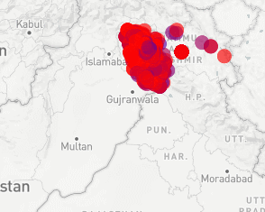

# Geospatial_Terror_ThreatLevel_Predictor
This was made During Hackfest'19(36 hour Hackathon)

## **Glimpse Of Our Tool**




**Short Project Description:**
We designed a geo-exploration tool that will predict the region of terrorist attack and then display the distribution of threat within that predicted region on the map.

**Dataset** : https://www.kaggle.com/START-UMD/gtd

**Overview:**
Terrorism is the biggest threat to humanity. Currently Intelligence Agencies rely heavily on their sources and informants to anticipate possible terror attacks but unfortunately, these sources usually do not have ‘complete information’. Predicting the exact latitude and longitude is unfeasable and error prone. So we designed a geo-exploration tool that uses this ‘incomplete information’ to predict the region of the attack and display the distribution of threat in that predicted region. This will alert local law enforcement agencies so that they can pay extra attention at the high risk areas. This can help the Defence agency’s Strategic Planning Process in states to counter terrorism.

To run the server:-
```
python temp.py
```

### Description
- **GTD.py** : Data preprocessing
- **encoded.csv** : Final Encoded Dataset ready for Training
- **ANN.py** : Deep Learning Model for Prediction
- **temp.py** : Dash File used for making the Geo-exploration tool
- **model.sav** : Trained Model
